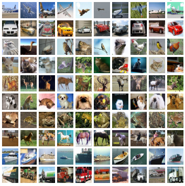

## Overview of Machine Learning Algorithms Used

Towards the beginning of the making of this project, I wanted to focus on mainly the Convolutional Neural Network model (CNN), mainly because of its versatility. However, for the final project, I wanted to demonstrate a basic Dense neural network so you can get a better understanding of why CNNs are so useful. 

For a background on what Convolutional Neural Networks and Dense Networks are, we have to look at the general structure of each of the models. Where CNN's and Dense networks differ is in how they process the data. Convolutional Networks were made with the idea of processing images and videos as the center point. 

The general idea of a CNN is that it takes a image (for this example one of a car) and then analyzes it in chunks so that the data can be processed. A good example of how this works is in the gif below: 

 

As you can see the algorithm scans the image in sections, which can be defined using a size of a square matrix (3x3 is the most common). From there, the algorithm then does some action to that smaller section, usually is max pooling. Max pooling is taking the most prominent largest data from the 3x3 matrix and getting rid of the other squares that were analyzed. One of the main questions that gets asked from this is: "If you were to get rid of 89% of data would it not be enough to produce the right results or be accurate at all?" Surprisingly, by scanning over groups of pixels and only pulling the "best" ones gives almost the same result as scanning over every pixel, but in a fraction of the time. 

Once new matrices are formed from the original image, the new matrix goes through the same process over and over again until the matrix can be flattened without losing data so that it can be processed. This process demonstrates the main limitation of computational abilities. Computers are limited to processing data in one dimensional objects which is the reason that images have be compressed into smaller matrices into eventual 1 dimensional matrices. The make up of neural networks are almost all the same across the board which is shown below. The main difference between different neural network layer models is the math behind the forward pass, backpropagation, or both. Backpropagation is the process by which a network goes backwards through the network in order to fix the weights that each connection has. This is done to improve the model because the model because more specific to the data that it was made for. 

## Training the Models

Every model can be trained on many different data sets. A CNN model for instance can be trained on any data set with thousands of categorized images. However, there are two main data sets that are used when learning about CNN models. THis is the CIFAR10 data set and MNIST data set. The CIFAR10 data set is comprised of 60,000 32x32 images that belong to collectively 10 categories. The 10 categories are as follows: Airplane, Automobile, Bird, Cat, Deer, Dog, Frog, Horse, Ship and Truck. This dataset is very useful for CNN models because of the amount of images as well as the variety within those images. Attached below is the CIFAR10 dataset image categories.

The other main image set that is usually used to train CNN models is the MNIST data set. This dataset is made up of images of hand drawn numbers 0-9. Both data sets have the categories of the images attached to the images themselves in order to allow the model to check its guess. This is called Supervised learning and is one of 3 main categories of machine learning. Attached below is the image of the MNIST dataset. 

However, for this model, I wanted to demonstrate the difference between normal CNN models and Dense models so the MNIST training set is being used, but it is being used to train the Dense model. Since the MINST data images contain less data overall than the CIFAR10 set, it is easier to train a dense network on. 

Both the CNN network used as well as the Dense network were trained with the benchmark for success being the accuracy when checking its answers. The model improves overtime depending on how many rounds the model was allowed to run for, or epochs. The greater amount of epochs, the greater the accuracy. However, for all neural networks, the epoch to accuracy ratio is one of diminishing returns. THis means that even though the accuracy will improve with more epochs, at some point, and its different for different models, the change in accuracy will become almost negligible relative to the time it takes to run the model. For instance, if you were to run a CNN model on the CIFAR10 dataset with 1,000 epochs, the accuracy will be higher than the accuracy rate for 500 epochs. However, the accuracy might be a few percentage points different, but it would take double the amount of time to train. In order to demonstrate this general idea, I decided to add different sets of epochs when training the CNN model. I showed the results from training with 1 epoch, 5 epochs, and 10 epochs.

The dense network was only run with 10 epochs, but the main reason in including the dense network model is to show the time difference between running the two models. When running the CNN model, each epoch might take between 80 and 100 seconds. On the other hand, the dense network model will take around 4-5 seconds per epoch. This is because the amount of calculations between the two are significantly different. 

## Results

The results of this project are very predictable. Below are the graphs of the CNN model running at three different epochs. As far as training and accuracy were concerned, the model vastly improved during the 10 epoch run, then it could during the 1 epoch run. This is because when the model is created, all of the weights for the connections are randomized and then fixed for the next run. Since the 1 epoch run, wasn't given another run through, the randomized weights were all the model could use to predict the answer. However, on the other runs, the model was given more attempts to correct the weights and get a better guessing technique. 

For the Dense network, I decided to only run 10 epochs due to the fact that the main purpose of including it was to demonstrate the diversity of the two models. The results showed that overtime the model vastly improved, as well as it taking significantly less time than the CNN counterpart. 

Throughout each of the results, one thing you can notice is that there are two different lines, or sets of points: one for the validation data and one for the training data. The validation accuracy and loss is determined when the model gets put up against a different set of the data set which was pre allocated. Although this factor is important, the main result to view is the training accuracy, or the red line/points. The training accuracy is a better indicator of how well the model will perform with the data. 

Another important thing to note about the results. THe results may change slightly depending on the run. One thing with machine learning algorithms is that since the weights are randomized for the first pass through and then fixed in concurrent runs, the weights randomly initialized could be significantly off of the ideal weights. THis would mean that it would take more epochs to get to the same weights. The weight updates for most machine learning algorithms are very minimal because with recognizing patterns, even a 1/100 of a change in the weights can drastically alter the accuracy values.

## Testing

The final section that I think would be best in the overview of this project is in regards to the testing aspect of it. In order to test an algorithm, you would have to pass it something that resembles what it has seen. For example, for this project, in order to test the CNN model, I passed a picture of a deer through it. This is because the data the model was trained on had deer as one of the categories. This doesn't mean you have to pass it a picture it has already seen, but it has to be similar. The deer picture that was passed through was not in the CIFAR10 dataset, but since the model already knew how to categorize deer, the model could correctly guess the picture. I passed this picture through the model:

From this the model was correctly able to guess that this picture was in fact a picture of a deer. 

## Conclusion

Overall, I think the main reason I decided to do this topic as my project for this course was to demonstrate both the uses of and complex nature of machine learning algorithms. How these algorithms truly work is a mystery because of the complex nature of all the calculations that are made which is one of the most fascinating ideas about them. In an attempt to make a brain-like thinking mechanism within computing, we created something eerily similar to where we understand the full nature of neither. I hope this project gives better insight into the basics of the world of machine learning. 