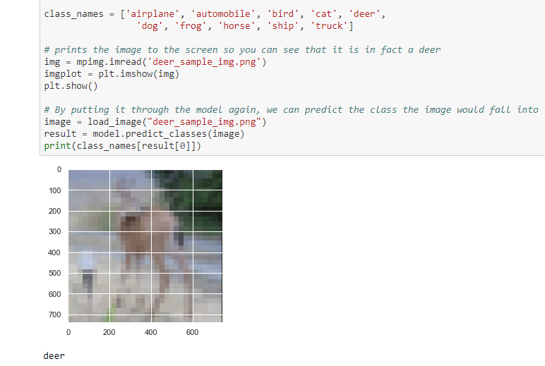

# CS510-Midterm
## Upated Version
#### Ryan Kassab

---
### Running This Code
---
All the information for running this code is here within the README, but all of the information on the background of the code or the results from the code will be found within the R Markdown Document or the converted .docx document that outlines the project. 

The running of this code is pretty straightforward. The code is based mainly off two libraries: keras and tensorflow. The data used, CIFAR10, comes installed with the keras package so no extra data needs to be used. 
In order to run this code, all you need to do it highlight all the code and hit run. No special instructions. 
Before the model begins to fit to the training data, the code will print out a summary of the model that it is using. It will outline the name and type of each layer as well as the parameters it contains. It will be easy to miss, but it can be interesting to see so you might have to scroll up to see it.
However, one thing to note: since this code is running a CNN model on 50,000 imgaes it will take about 10 minutes complete. If you exit before this is done then it will ahve to be restarted if the same resutls are to be expected. The progess will be printed along the way through the EPOCHS including the amount of time and epochs left. 

By the end of the code, there should be two graphs that are produce each with two separate lines with tracked points. This is mainly just to demonstrate how the accuracy of the model improves overtime and how the loss decreases overtime. 

If code does not work, it could be because the basis of the packages used are python related so if you do not have python or anaconda installed it might call a few errors. The error messages that RStudio produces will most likely be the most helpful solutions. For me, the problems I ran into consisted mainly of not having miniconda installed in the right place, but once I solved that the code worked fine. If that error message doesn't come up for you, great! If it does, that would be how to solve it. 

---
### Testing 
---

The testing of this code was unable to be done using R. I ran into some problems regarding the connection between tensorflow and anaconda because tensorflow's basis is built on python. In order to demonstrate that I did infact tested the code, I attached an html file whete the exact same code, modified for python, was run in a python environment. 

The testing that was conducted was simply sending an image that would be included within the classes, but not necessarily in the dataset and having the model predict the class that the image belongs to. For this example I used an image of a deer because deers are included within the CIFAR dataset. The model then reads the image data and then predicts the image to be a deer. 

Within the Testing folder, you will find a jupyter notebook that contains the python code, an HTML copy of that jupyter notebook, the screenshot of the deer, and the screenshot just showing the test and not the rest of the model. 

---
### Results
---

I added a folder that contains all of the results that should be expected from running the code. This includes a set of two graphs and the summary of the model. The summary of the model is printed within the terminal, but the graphs will be found in the viewer tab of RStudio
